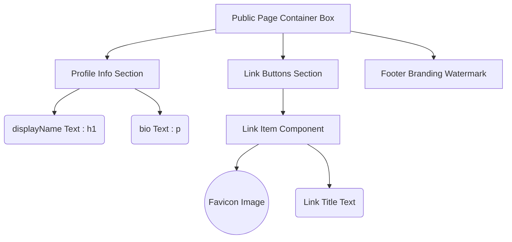
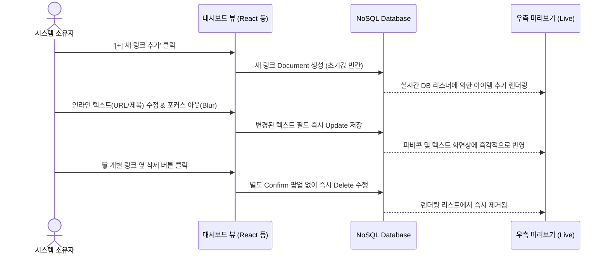

# 마이링크 (MyLink) - 화면 와이어프레임 (Wireframe)

본 문서는 프론트엔드 퍼블리싱 및 기능 구현의 지표가 될 시각적 구조를 ASCII Art와 Mermaid 다이어그램을 활용하여 정의한 와이어프레임입니다.

---

## 1. 퍼블릭 프로필 페이지 (Public Profile)

퍼블릭 페이지는 외부 방문자가 주로 모바일을 통해 접근하므로, 모바일 환경에 최적화된 반응형 프레임(Max-Width: 약 480px) 위주로 설계됩니다.

### 1-1. 화면 레이아웃 (ASCII Art)

```text
+-----------------------------------+
|                                   |
|      [ @displayName (User) ]      |
|    "소개글(Bio) 공백 포함 최대 80자" |
|                                   |
+-----------------------------------+
|                                   |
|  +-----------------------------+  |
|  | (F) 내 블로그 구경하기      |  |
|  +-----------------------------+  |
|                                   |
|  +-----------------------------+  |
|  | (F) 깃허브 포트폴리오 모음  |  |
|  +-----------------------------+  |
|                                   |
|  [        Powered by MyLink    ]  |
+-----------------------------------+
```
*※ `(F)` 영역은 구글 API를 통해 캐싱된 목적지 URL의 파비콘 이미지가 배치될 자리입니다.*
*※ **Empty State**: 만약 가입 후 등록된 링크가 단 하나도 없다면, 링크 영역 전체가 텅 비지 않도록 중앙에 `📁 아직 등록된 링크가 없습니다.` 라는 시각적 안내 빈 섹션을 표시합니다.*
*※ **워터마크 푸터**: 오가닉 사용자 유입을 위해 모든 접속 페이지 하단에 `Powered by MyLink` 텍스트 레이블을 의무적으로 노출합니다.*

### 1-2. 컴포넌트 계층 구조 (Mermaid)



---

## 2. 관리자 대시보드 화면 (Admin Dashboard)

웹 데스크탑 환경 기준(Split View)으로, 화면을 양분하여 좌측은 [설정 창], 우측은 [모바일 미리보기 창]으로 설계하여 직관성을 높입니다.

### 2-1. 대시보드 레이아웃 (ASCII Art)

```text
======================================================================
[ Header: 웹 로고 | 내 링크: mylink.com/Name             [로그아웃]  ]
======================================================================
|               [편집 패널 (Left)]             |  [미리보기 (Right)] |
|                                              |                     |
|  [프로필 설정]                               |  +---------------+  |
|   닉네임: [ 인라인 수정 (클릭 시 입력창) ]   |  |               |  |
|   소개글: [ 인라인 수정 (최대 80자 제한) ]   |  | @Name         |  |
|                                              |  | 최대 80자     |  |
|  [비즈니스 링크 관리]                        |  |               |  |
|   +---------------------------------------+  |  | [ (F) 블로그 ]|  |
|   | 1. [접속 파비콘 이미지 영역 노출]     |  |  | [ (F) 깃허브 ]|  |
|   |    제목: [ 인라인 수정 텍스트 영역 ]  |  |  +---------------+  |
|   |    URL : [ 인라인 수정 텍스트 영역 ]  |  |    Live Preview     |
|   |                            [삭제 🗑️] |  |                     |
|   +---------------------------------------+  |                     |
|                                              |                     |
|   [ + 새로운 링크 블록 추가 (Add) ]          |                     |
|                                              |                     |
======================================================================
```

### 2-2. 대시보드 상호작용 및 데이터 흐름도 (Mermaid)


